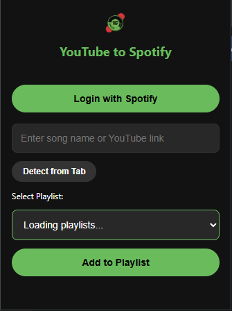

# 🎵 LinkTube

**LinkTube** es una extensión de navegador diseñada para los amantes de la música que quieren ahorrar tiempo. Sincroniza y guarda instantáneamente tus canciones favoritas directamente en tus playlists de Spotify mientras navegas.

---

## 🚀 Características principales
* **Sincronización instantánea**: Guarda canciones en un solo clic.
* **Integración con Spotify**: Conexión directa mediante API oficial.
* **Ligera y rápida**: Ejecución eficiente en segundo plano.

---

## 📸 Screenshots

<div align="center">
  
  
</div>

---

## 🛠️ Tecnologías utilizadas

| Tecnología | Uso |
| :--- | :--- |
| **JavaScript (ES6+)** | Lógica de la extensión y llamadas a la API. |
| **HTML5** | Estructura del popup y opciones. |
| **CSS3** | Diseño minimalista y moderno. |
| **Chrome Extension API** | Integración con el ecosistema del navegador. |
| **Spotify Web API** | Autenticación y gestión de playlists. |

---

## 📦 Instalación

1. Clona este repositorio:
   ```bash
   git clone [https://github.com/IGprojects/LinkTube.git](https://github.com/IGprojects/LinkTube.git)
